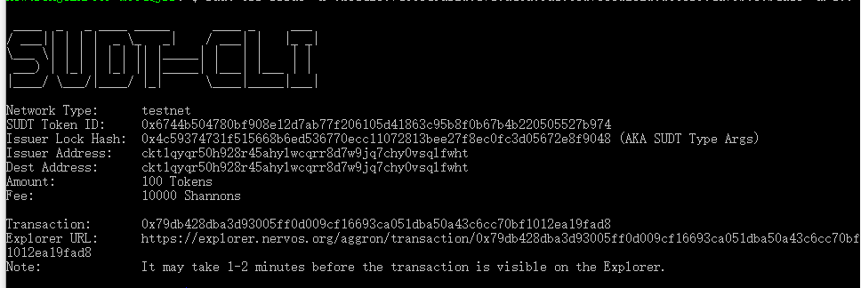
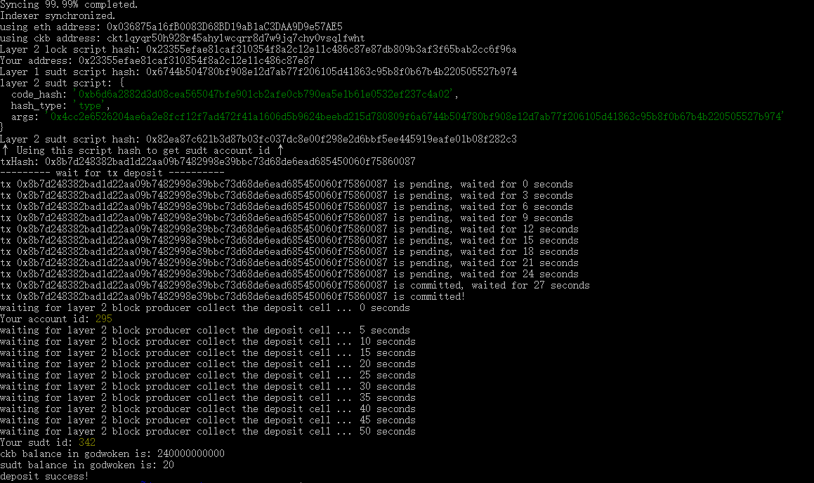

1.A link to the Layer 1 address you funded on the Testnet Explorer:

https://explorer.nervos.org/aggron/address/ckt1qyqr50h928r45ahylwcqrr8d7w9jq7chy0vsqlfwht

2. A screenshot of the console output immediately after using sudt-cli to create your SUDT tokens on Layer 1.

3.A link to the transaction ID created by sudt-cli on the Testnet Explorer.

https://explorer.nervos.org/aggron/transaction/0x79db428dba3d93005ff0d009cf16693ca051dba50a43c6cc70bf1012ea19fad8
 

4.A screenshot of the console output immediately after you have successfully submitted a deposit to Layer 2 using the account-cli tool.

5.The SUDT ID from the console output after executing the deposit script (in text format).

342
