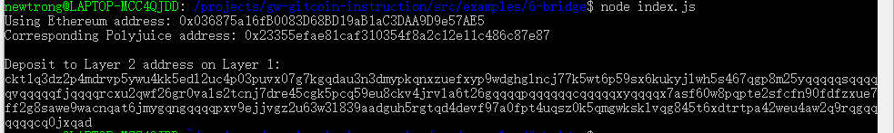

1.A screenshot of the console output immediately after you have successfully generated your Deposit Receiver Address.

2. Your Deposit Receiver Address (in text format).

ckt1q3dz2p4mdrvp5ywu4kk5edl2uc4p03puvx07g7kgqdau3n3dmypkqnxzuefxyp9wdghglncj77k5wt6p59sx6kukyjlwh5s467qgp8m25yqqqqqsqqqqqvqqqqqfjqqqqrcxu2qwf26gr0vals2tcnj7dre45cgk5pcq59eu8ckv4jrvla6t26gqqqqpqqqqqqcqqqqqxyqqqqx7asf60w8pqpte2sfcfn90fdfzxue7ff2g8sawe9wacnqat6jmygqngqqqqpxv9ejjvgz2u63w3l839aadguh5rgtqd4devf97a0fpt4uqsz0k5qmgwksklvqg845t6xdtrtpa42weu4aw2q9rqgqqqqqqcq0jxqad

3.The Ethereum address used to generate the Deposit Receiver Address (in text format).

 0x036875a16fB0083D68BD19aB1aC3DAA9D9e57AE5
 

4.A link to the Etherscan explorer for the successful Force Bridge transaction.

https://rinkeby.etherscan.io/tx/0xceaced0347c244cedd0943d6387debbfd053c923ecdf61a8a6b23132ff839f7f

5.A link to the Nervos explorer for the successful Force bridge transaction. 

https://explorer.nervos.org/aggron/transaction/0xf778e49d39d586b625e0317ffcf0cec19f0c33cf5bea670802a7a64b81364a82
